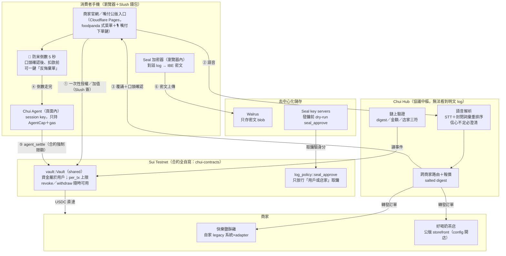

<p align="center"></p>

# Chui Protocol（嘴付協議）—— 應用層

> 用一句話點餐，用一筆鏈上交易付款。
> Chui 是 agentic commerce 的**支付授權層**：消費者一次性授權（Mandate），
> 之後由語音 agent 在授權額度內代為結算——不用助記詞、不用付 gas、
> 鏈上看不到你買了什麼。

**Chui 是基礎設施**：終端使用者永遠不會看到這個名字，他們只會看到
店家的網站聽懂了「中冰奶」，然後測試幣從自己的錢包進了店家的錢包。

> **🎬 Demo（最新）**：兩家異質商家（自家系統經 adapter 接入的「快樂鹽酥雞」
> ＋公版店面開的「好喝奶茶店」）＋語音入口 App＋即時封包面板，
> Slush 錢包 USDC on Sui Testnet 結帳。
> 協議規格見 **[PROTOCOL.md](PROTOCOL.md)**、演示腳本見 **[DEMO.md](DEMO.md)**、
> 一鍵啟動 `./scripts/demo-up.sh`。合約在 chui-contracts 的
> `contracts/sui/`（`./deploy.sh` 一鍵部署）。

---

## 問題陳述

語音點餐的「聽懂」與「付款」之間有一道鴻溝：

1. **STT 不可信**。台灣路邊早餐店的點餐語音充滿縮寫（「中冰奶」）、
   台語混講（「菜頭粿」）、與辨識錯字（「但餅」）。直接把 STT 輸出
   丟給支付流程，等於拿雜訊扣款。
2. **語音介面必然重複觸發**。使用者會連按、網路會重送、bot 會 retry。
   沒有冪等性的支付路徑在語音場景是災難。
3. **代理支付需要授權模型**。agent 代人付款，就必須回答「誰授權的、
   上限多少、怎麼撤銷」，而且答案要可驗證，不能只是資料庫裡的一列。

Chui 的回答：**封閉詞彙重排序**解決（1），**多層冪等防線**解決（2），
**鏈上 Mandate（Sui shared object）**解決（3）。

## STT 準確率（本專案最重要的數字）

評估資料集：55 筆標註的口語訂單（52 筆可解析＋3 筆必須澄清），
涵蓋乾淨句、STT 誤辨字、縮寫、台語詞、多品項組合。
執行 `cd apps/api && python eval/run_eval.py` 可重現：

| 指標 | 原始 STT（精確比對基線） | 封閉詞彙重排序後 |
|---|---|---|
| 品項辨識準確率（52 筆） | 34.6% | 100.0% |
| 訂單完全正確率（52 筆） | 21.2% | 100.0% |
| 應澄清即澄清（3 筆） | — | 100.0%（無聲猜錯 0 筆） |

方法：取 STT 候選文字，與**該店家**菜單的封閉詞彙（品項、選項、同義詞）
做「拼音距離＋台灣華語混淆表（ㄓㄗ、ㄋㄌ、前後鼻音…）」的滑動視窗比對，
動態規劃選出最佳不重疊組合；「中冰奶」靠字首縮寫展開＋鄰接證據對回
「中杯冰奶茶」。信心度不足或前二名太接近時**必須提出澄清問題，絕不猜**
——在支付情境下，猜錯比多問一輪糟糕得多。

> 誠實聲明:資料集中的 STT 文字是「依常見華語誤辨模式標註的模擬輸出」
> （含真實錯字型態），不是真實錄音跑 STT 的結果。真機錄音的端到端
> 準確率驗證列在 TESTING.md 測試 C，需要實體裝置。
> 台語只透過菜單同義詞在重排序層救回，**不在關鍵路徑上**（stretch goal）。

## 架構



資料流重點：
- **防呆倒數（④）**：使用者口頭說「確認」之後、真正扣款之前，固定有
  5 秒反悔窗口，畫面上有大顆「✋ 反悔棄單」——按下即整單放棄、零扣款。
- **資金不離開用戶**：USDC 在用戶自己的 `Vault`（shared object），
  Agent 只拿 `AgentCap` 權限物件；合約強制單筆上限與餘額檢查，
  錢從 Vault 直達店家。撤銷／領回隨時可由用戶單方執行。
- **鏈上只有 digest**：`SHA-256(canonical_json(明細) ‖ 32B CSPRNG salt)`。
  explorer 看不到品項與精確金額組成。
- **對話 log 端對端加密（⑥）**：整段點餐對話在「用戶瀏覽器內」以
  Seal（門檻式 IBE）加密後上傳 Walrus；身分 id＝用戶地址‖店家地址，
  Seal key server 發鑰前會 dry-run 鏈上 `log_policy::seal_approve`——
  **只有用戶錢包與店家能解密，嘴付平台（Hub）無權看**。

## 贊助商／外部資源整合狀態（核對表）

| 資源 | 在嘴付的角色 | 模型／設定 | 狀態 |
|---|---|---|---|
| **ElevenLabs** | 語音辨識主力（STT 鏈第 1 位） | Scribe v2（`cmn`；簡→繁正規化兜底） | ✅ 已上線 |
| **GMI Cloud** | LLM 重述備援（聽不懂時重述成菜單詞彙再解析；不碰金流） | GLM-4.7-Flash（免費層） | ✅ 已上線 |
| **Atlas Oracle** | 台幣→USDC 即時匯率（簽章報價、30 秒快取、鎖進訂單） | USDC/USD feed＋`ATLAS_TWD_PER_USD` | 🔜 程式就緒，待 API key（docs.atlasoracle.io 註冊） |
| **AMD** | LLM 備援第二槽（OpenAI 相容） | 待賽方發 key 後選型 | ⏳ 等額度發放 |
| **EastRouter** | LLM 備援（與 GMI 同插槽，`EASTROUTER_*` 相容變數） | — | ⏳ 等 key |
| OpenAI（自備） | STT 遞補（第 2、3 位） | gpt-4o-transcribe → whisper-1 | ✅ 已上線 |
| Sui Testnet | 結算鏈（自寫 vault 合約、gRPC 驗證） | — | ✅ |
| Mysten Seal＋Walrus | 對話紀錄端對端加密存證（平台無鑰） | threshold-1 IBE＋3+3 節點輪替 | ✅ |

驗證方式：`curl https://hub.chuiprotocol.com/healthz`——看 `stt_chain`／`llm_assist`／`fx_source` 三個欄位的即時狀態。

### 設計備註：取餐單號前綴為什麼只要 2 個英文字母

店家自助入駐（`?open=1`）時單號前綴必填 2 個英文字母（例 `TF-0905-0001`）。
只取 2 字母就夠的原因：**店主錢包地址是唯一的**（一顆錢包＝一家店，
merchant_id 由地址衍生），取餐單號只需要「店內唯一」——日期前綴＋
持久化流水號已保證這點——前綴純粹是現場叫號時的辨識用，不承擔任何
唯一性責任，短一點反而好唸好記。

## 外部服務整合

| 服務 | 用途 | 沒設定時 | healthz 揭露 |
|---|---|---|---|
| **Atlas Oracle**（`atlasoracle.io`，價格預言機） | 菜單台幣 → 鏈上 USDC 的**即時匯率**：Pull API 簽章報價（30 秒快取），匯率在報價當下鎖進訂單、整數運算；`ATLAS_RATE_MULTIPLIER` 供內部測試縮小匯率省測試幣 | 退回 `.env` 的 `USDC_UNITS_PER_TWD` 固定匯率 | `fx_source: atlas-oracle / static-env` |
| **MongoDB Atlas**（資料庫雲，與上者只是撞名） | **訂單持久化**：訂單／取餐單號／付款與鏈上驗證狀態存雲端資料庫——Hub 重啟不掉單，冪等檢查升級成真資料庫層；`./scripts/setup-atlas.sh '<連線字串>'` 一鍵接線 | 退回行程記憶體（重啟清空） | `order_store: mongodb-atlas / memory` |
| EastRouter（LLM 聚合 API） | 語音解析信心不足時把原文**重述成菜單詞彙標準句**再解析；LLM 只做重述，扣款仍要口頭確認＋5 秒防呆倒數 | 直接走澄清流程 | `llm_assist: eastrouter / off` |
| Seal ＋ Walrus（Mysten） | 點餐對話 log **端對端加密存證**：瀏覽器內加密、密文上 Walrus，只有用戶錢包與店家可解（見架構圖⑥） | 不做存證（不影響付款） | `seal_key_servers` 等欄位 |

以上全部「可插拔、失敗誠實退回」：任何一個外部服務掛掉都不會擋住點餐主流程。

## 冪等性（同一筆訂單 confirm N 次只扣一次）

1. 已結算 → 直接回同一張收據（HTTP 200）。
2. 結算中 → 409 `SETTLEMENT_IN_PROGRESS`，SDK 指數退避重試後拿到同一張收據。
3. 資料庫原子狀態轉移（`quoted/failed → settling`）保證單一執行者。
4. `settlements.order_id` UNIQUE 約束為最後防線。
5. chain-service 以訂單 digest 去重：API 在「已上鏈、未落庫」的窗口崩潰後
   重試，也不會第二次上鏈。
6. 另有 nonce + timestamp 防重放（±300 秒、nonce 一次性）。

單元測試涵蓋序列與 5 執行緒並發情境（`apps/api/tests/test_idempotency.py`）。

## 與其他 agentic commerce 方案的比較

（查證日期 2026-08-26；快速演變中的領域，數字會過時）

| | **Chui** | Coinbase x402 | Google AP2 | Visa Intelligent Commerce |
|---|---|---|---|---|
| 一句話 | 語音點餐的鏈上授權支付層 | HTTP 402 穩定幣微支付協議 | 支付方式中立的 agent 授權協議（mandate 鏈） | 卡網路的 agent 代付平台（AI-Ready Cards） |
| 授權模型 | 鏈上 Mandate shared object（單筆/總額上限、單一交易撤銷） | 每筆請求錢包簽名 | 密碼學簽署的 Intent/Cart/Payment Mandate | Token 綁定 agent 身分＋spend controls |
| 上鏈 | 是（Sui；只上 salted digest） | 是（Base、Solana 為主） | 核心否；x402 擴充可上鏈 | 否 |
| 託管 | 資金在消費者的 Mandate 物件；營運方可觸發限額內結算（見信任假設） | 非託管＋facilitator 結算 | 不託管資金，走既有軌道 | 託管（四方卡組織） |
| 成熟度 | 原型（Testnet） | 協議成熟、真實交易量仍極低（2026-03 報導約 $28K/日，含測試流量） | v0.2，已捐 FIDO Alliance 標準化，試點中 | 試點邁向規模化，Connect 預計 2026 稍後 GA |
| 語音/嘈雜輸入 | **核心設計**（封閉詞彙重排序＋強制澄清） | 範圍外 | 範圍外（假設 agent 已知意圖） | 範圍外 |

差異化：x402 解決「機器對機器怎麼付」，AP2 解決「授權證據鏈長怎樣」，
Visa 解決「怎麼讓既有卡網路接受 agent」。Chui 解決的是它們都沒碰的最前面
一哩：**從嘈雜的人類語音到可安全執行的支付意圖**，然後用最小的鏈上足跡
（一個 digest）完成可驗證結算。

## 信任假設（誠實版）

本系統**尚未達成完全非託管／零知識**。你需要信任 Chui 營運方的部分：

1. **解析時看得到明細**：STT 與重排序在伺服器端執行，營運方在 parse
   當下技術上看得到訂單內容（雖然不落地儲存明文）。加密保護的是
   「落地儲存」與「鏈上隱私」，不是「對營運方的隱私」。
2. **結算觸發權**：chain-service 的 operator key 可在 Mandate 限額內發起
   結算。合約限額（單筆上限、總額、撤銷）是鏈上強制的，但「該不該扣
   這一筆」的判斷在鏈下。惡意營運方可以在限額內發起消費者未確認的
   結算——上限與撤銷就是消費者的損害控制。
3. **gas 贊助者**：營運方可拒絕贊助（服務中斷風險），但不能因此動用
   消費者資金。
4. **zkLogin salt 保管**：salt 由營運方以 HMAC 決定性導出。營運方遺失
   master secret＝所有 zkLogin 地址無法重建；營運方作惡＋拿到使用者
   JWT 才能重建地址（仍無法簽名，簽名需 ephemeral key）。
5. **明細金鑰遺失風險**：order_key 只在 parse 回應出現一次，由消費者端
   （LIFF/後台 IndexedDB）保存。換手機＝舊收據無法解密（digest 仍可驗證
   存在性）。

消費者**不需要**信任的部分：限額與撤銷的執行（鏈上合約強制）、
收據真實性（`scripts/verify.ts` 可離線驗證 digest ↔ 明細對應）、
資金保管（在 Mandate 物件，不在 Chui 的帳戶）。

## 快速上手

```bash
# 0. 前置：Node 22+、pnpm 10+、Python 3.11+
cp .env.example .env          # 逐項填入（見 SETUP.md）
pnpm install
pip install -r apps/api/requirements.txt

# 1. 啟動鏈上服務（terminal 1）
cd apps/api/chain-service && node --env-file=../../../.env src/index.js

# 2. 啟動 API（terminal 2）
cd apps/api && python -m uvicorn chui_api.main:app --port 8787 --env-file ../../.env

# 3. 預先合成 TTS 快取（建議；離線覆誦靠它）
python scripts/prebuild-tts.py --menu examples/happy-pig/menu.json

# 4. 後台（terminal 3）
pnpm --filter @chui/console dev        # http://localhost:5173

# 5. 參考店家 LINE bot（terminal 4；需 LINE 憑證，見 SETUP.md）
pnpm --filter @chui/reference-merchant start

# 測試
cd apps/api && python -m pytest tests/ -q && python eval/run_eval.py
pnpm --filter @chui/sdk test
```

店家介接只需要 SDK：見 `packages/sdk/README.md`（五分鐘介接）。
手機實測腳本：見 `TESTING.md`。

## Repo 結構

```
packages/sdk               店家 SDK（@chui/sdk）：parse/confirm/webhook/verify
apps/api                   FastAPI：菜單、重排序、TTS 降級、冪等結算、webhook
apps/api/chain-service     Node sidecar：sponsored tx、結算去重（@mysten/sui v2）
apps/console               店家＋消費者後台（撤銷按鈕在這）
apps/reference-merchant    快樂豬 LINE bot + LIFF（只用 @chui/sdk）
examples/happy-pig         範例菜單（含選項、同義詞、台語詞）
apps/api/eval              重排序評估 harness 與 55 筆標註資料集
scripts/prebuild-tts.py    TTS 快取預合成
scripts/verify.ts          收據 digest 離線驗證
```

## 重要限制（也寫在 DECISIONS.md）

- **chui-contracts repo 目前是空的**：拿不到 package ID、shared object ID
  與 Move 介面。本 repo 以「假定介面」實作 chain-service（全部可設定），
  未設定 `CHUI_PACKAGE_ID` 時所有鏈上操作明確回 `CHAIN_NOT_CONFIGURED`，
  絕不偽造結算。合約 repo 補上後，只需核對 `.env` 的 module/function/
  abort code 對映即可接上。
- 「薯餅**兩個**」這類「數量在品項後」的口語目前不回填數量（會當 1 份）；
  「品項後的數字」只在對得上規格選項（「鍋貼十顆」）時生效。
- Rate limit 與 TTS 快取為單機實作；多實例部署需外部化（Redis／共享儲存）。
