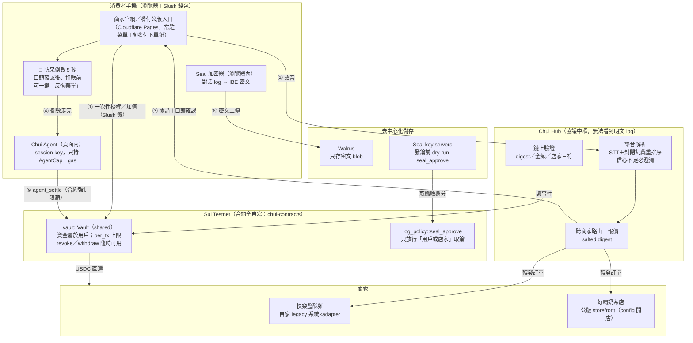

<p align="center"></p>

<h3 align="center">開口就買單，嘴付真簡單——語音點餐的鏈上支付授權層</h3>

<p align="center">
  <a href="https://github.com/chuiprotocol/chui-app/actions"></a>
  
  
  <a href="https://github.com/chuiprotocol/chui-app/releases"></a>
  
</p>

<p align="center">
  <a href="https://chuiprotocol.com"><b>🌐 Live Demo</b></a> ·
  <a href="#-兩分鐘看懂嘴付">🎬 影片</a> ·
  <a href="https://chuiprotocol.com/developers/">🔌 API 文件</a> ·
  <a href="PROTOCOL.md">📜 協議規格</a> ·
  <a href="DECISIONS.md">🧭 決策紀錄</a> ·
  <a href="https://github.com/chuiprotocol/chui-contracts">⛓ Move 合約</a>
</p>

---

打開外送 App 要滑選單、加購物車、填地址輸卡號——流程多年沒變。**嘴付協議**把這一切
交給語音 AI Agent：說一句「珍奶無糖少冰」，ElevenLabs Scribe 辨識（OpenAI 備選）、
封閉詞彙重排序鎖定菜單品項（評估集 52/52、聽不清必澄清）、GMI Cloud GLM 補語意，
Agent 憑 Sui Move 金庫的 AgentCap 自動結帳——**合約強制單筆上限、一鍵撤銷、非託管**，
款項直達店家，穩定幣結算免跨境抽成；對視障者與長者更是**點餐不求人**。
已上線 [chuiprotocol.com](https://chuiprotocol.com)，店家錢包簽名即自助開店，
MIT 開源附 2 分鐘 Demo 影片。

## 🎬 兩分鐘看懂嘴付

<p align="center">
  <a href="https://youtu.be/G8o4Wx5MeNM">
    
  </a>
  <br/>
  <sub>▶️ 點縮圖看 2 分鐘 Demo（YouTube）</sub>
</p>

自己動手玩：

| 網址 | 內容 |
|---|---|
| **[chuiprotocol.com](https://chuiprotocol.com)** | 嘴付公版入口：選店語音點餐／我要開店／店家後台／我的訂單 |
| **[happy-chicken.chuiprotocol.com](https://happy-chicken.chuiprotocol.com)** | 快樂鹽酥雞「自家官網」——只串嘴付協議 API 的整合示範 |
| **[hub.chuiprotocol.com/healthz](https://hub.chuiprotocol.com/healthz)** | 協議中樞（Cloudflare Worker）即時狀態 |
| **[hub.chuiprotocol.com/panel](https://hub.chuiprotocol.com/panel)** | 協議封包即時面板（demo 投影用） |
| **[chuiprotocol.com/developers](https://chuiprotocol.com/developers/)** | 店家 API 文件：兩條接入路徑、全端點參考、adapter 模式 |
| **[chuiprotocol.com/developers/agent](https://chuiprotocol.com/developers/agent)** | AI Agent 串接導引：自有品牌店家複製一段 prompt 給 Claude Code／Codex 即完成串接（另供 [llms.txt](https://chuiprotocol.com/llms.txt) 給 AI 工具自動讀取） |

> 需要 [Slush 錢包](https://slush.app)（[Chrome 擴充功能](https://chromewebstore.google.com/detail/slush-%E2%80%94-a-sui-wallet/opcgpfmipidbgpenhmajoajpbobppdil)／[iOS App](https://apps.apple.com/us/app/slush-a-sui-wallet/id6476572140)，選 Sui Testnet）＋測試用 USDC（[Circle Faucet](https://faucet.circle.com) 免費領）。

## 問題陳述

語音點餐的「聽懂」與「付款」之間有一道鴻溝：

1. **STT 不可信**。台灣路邊早餐店的點餐語音充滿縮寫（「中冰奶」）、
   台語混講（「菜頭粿」）、與辨識錯字（「但餅」）。直接把 STT 輸出
   丟給支付流程，等於拿雜訊扣款。
2. **語音介面必然重複觸發**。使用者會連按、網路會重送、bot 會 retry。
   沒有冪等性的支付路徑在語音場景是災難。
3. **代理支付需要授權模型**。agent 代人付款，就必須回答「誰授權的、
   上限多少、怎麼撤銷」，而且答案要可驗證，不能只是資料庫裡的一列。

Chui 的回答：**封閉詞彙重排序**解決（1），**多層冪等防線**解決（2），
**鏈上 Vault＋AgentCap（自寫 Sui 合約）**解決（3）。

## STT 準確率（本專案最重要的數字）

評估資料集：55 筆標註的口語訂單（52 筆可解析＋3 筆必須澄清），
涵蓋乾淨句、STT 誤辨字、縮寫、台語詞、多品項組合。
執行 `pnpm --filter @chui/hub-worker test` 可重現（評估集是 CI 的品質門檻，跌破 90% 直接紅燈）：

| 指標 | 原始 STT（精確比對基線） | 封閉詞彙重排序後 |
|---|---|---|
| 品項辨識正確（52 筆可解析） | 18/52（34.6%） | **52/52**（本資料集） |
| 訂單完全正確（52 筆可解析） | 11/52（21.2%） | **52/52**（本資料集） |
| 應澄清即澄清（3 筆） | — | 3/3，**無聲猜錯 0 筆** |

> 數字怎麼讀：52/52 是「在這份標註資料集上」的結果，不是宣稱真實世界
> 100%——所以 CI 品質門檻刻意設在 **≥90%**（低於門檻直接紅燈），
> 真實環境的長尾由「多供應商 STT 鏈＋信心不足強制澄清」兜底：
> 寧可多問一輪，絕不無聲扣錯錢。

方法：取 STT 候選文字，與**該店家**菜單的封閉詞彙（品項、選項、同義詞）
做「拼音距離＋台灣華語混淆表（ㄓㄗ、ㄋㄌ、前後鼻音…）」的滑動視窗比對，
動態規劃選出最佳不重疊組合；「中冰奶」靠字首縮寫展開＋鄰接證據對回
「中杯冰奶茶」。信心度不足或前二名太接近時**必須提出澄清問題，絕不猜**
——在支付情境下，猜錯比多問一輪糟糕得多。

> 誠實聲明:資料集中的 STT 文字是「依常見華語誤辨模式標註的模擬輸出」
> （含真實錯字型態），不是真實錄音跑 STT 的結果。真機錄音的端到端
> 準確率驗證列在 TESTING.md 測試 C，需要實體裝置。
> 台語只透過菜單同義詞在重排序層救回，**不在關鍵路徑上**（stretch goal）。

## 架構



資料流重點：
- **防呆倒數（④）**：使用者口頭說「確認」之後、真正扣款之前，固定有
  5 秒反悔窗口，畫面上有大顆「✋ 反悔棄單」——按下即整單放棄、零扣款。
- **資金不離開用戶**：USDC 在用戶自己的 `Vault`（shared object），
  Agent 只拿 `AgentCap` 權限物件；合約強制單筆上限與餘額檢查，
  錢從 Vault 直達店家。撤銷／領回隨時可由用戶單方執行。
- **鏈上只有 digest**：`SHA-256(canonical_json(明細) ‖ 32B CSPRNG salt)`。
  explorer 看不到品項與精確金額組成。
- **對話 log 端對端加密（⑥）**：整段點餐對話在「用戶瀏覽器內」以
  Seal（門檻式 IBE）加密後上傳 Walrus；身分 id＝用戶地址‖店家地址，
  Seal key server 發鑰前會 dry-run 鏈上 `log_policy::seal_approve`——
  **只有用戶錢包與店家能解密，嘴付平台（Hub）無權看**。

## 為什麼這樣設計（維護者必讀）

架構上每個「奇怪的地方」都有原因，完整記錄在 [DECISIONS.md](DECISIONS.md)（31 條）。最重要的幾條：

- **封閉詞彙重排序，不是問 LLM**（D2）：支付情境下，STT 錯字必須被「確定性演算法」
  救回或明確拒絕——LLM 只在信心不足時做「重述」備援，永遠碰不到金流決策。
- **指令詞永遠優先於菜單比對**（D30）：引擎只認識菜單，曾把「結束對話」硬配成
  「地瓜薯條」（0.62 信心）——所以前端拿到 STT 原文先過 `intents.ts` 判讀。
  意圖判讀前先做**簡→繁正規化**：上游 STT 可能輸出簡體（「确认下单」）。
- **一顆 Durable Object 就是整個後端狀態**（D29）：訂單、取餐單號流水、SSE 匯流排
  全在單一 SQLite DO——actor 模型天然無競態，取餐單號「日期＋持久化流水」永不重複。
- **錢包即身分**（D31）：店家開店＝Slush 簽名證明收款地址所有權；後台登入＝連錢包
  比對收款地址；用戶訂單歸戶＝鏈上 SettlementEvent 的 owner。平台不代管任何私鑰。
- **誠實失敗哲學**（貫穿全案）：STT 掛了就說掛了、鏈上查不到就 pending、外部服務
  全部「可插拔、失敗誠實退回」——絕不假成功、絕不無聲猜測。
- **Workers 的坑**（D29）：`pinyin-pro` 與 `@mysten/sui` 都在模組頂層做 Workers
  禁止的全域操作（setTimeout／隨機值）→ 一律 handler 內動態 `import()`。

## 快速上手（開發）

```bash
# 前置：Node 22+、pnpm 10+
pnpm install

# 後端（Cloudflare Worker，本地模擬）
pnpm --filter @chui/hub-worker dev        # http://localhost:8787

# 前端（另一個 terminal；?hub= 指向本地後端）
pnpm --filter @chui/portal dev            # http://localhost:5173/?hub=http://localhost:8787

# 測試（重排序對齊＋評估集門檻＋意圖判讀回歸，41 案例）
pnpm --filter @chui/hub-worker test
```

合約開發見 [chui-contracts](https://github.com/chuiprotocol/chui-contracts)（`sui move test` 17 案例、`./deploy.sh` 一鍵部署）。

## Repo 結構

```
apps/hub-worker        協議中樞（Cloudflare Worker＋Durable Object）：
                       STT 供應商鏈、封閉詞彙重排序、報價、接單發號、
                       鏈上驗證、店家註冊、SSE 面板    ← 後端本體
apps/portal            嘴付公版入口（選店/點餐/開店/後台/歷史）
apps/merchant-a        快樂鹽酥雞：自家官網前端＋legacy 系統＋協議 adapter
                       （backend/ 與 adapter/ 示範「既有系統不改一行舊碼接入協議」）
apps/storefront-template  公版店面範例（config 開店的本機版）
apps/voice-app         跨店語音入口（說一句話自動路由到對的店家）
packages/chui-web      三個前端共用的核心庫：語音循環（VAD/barge-in/TTS）、
                       Agent session（vault 授權/自動結算）、Seal 加密存證、意圖判讀
eval/dataset.jsonl     55 筆標註口語訂單（CI 品質門檻）
examples/happy-pig     評估用範例菜單（縮寫/台語/同義詞齊全）
branding/              品牌系統（tokens.css＋SVG）
scripts/               部署自動化（Cloudflare Worker/Pages/網域，皆冪等可重跑）
```

## 測試、CI/CD 與分支策略

- **CI**（GitHub Actions）：每次 push 跑「共用庫型別檢查＋Worker 建置＋41 個測試
  （含 55 筆評估集 ≥90% 門檻、指令詞/回音/簡繁回歸）＋四個前端建置」。
- **CD**（Cloudflare Git 整合）：push 到主分支即自動部署 `chui-hub`（Worker）、
  `chui-portal` 與 `chui-happy-chicken`（Pages）——無手動步驟。
- **分支**：`main` 為唯一長期分支（護 CI 綠）；功能用短命 feature branch 進 PR。
- 合約另居 [chui-contracts](https://github.com/chuiprotocol/chui-contracts)：
  17 個 Move 測試、發佈腳本冪等。

## 贊助商／外部資源整合狀態（核對表）

| 資源 | 在嘴付的角色 | 模型／設定 | 狀態 |
|---|---|---|---|
| **ElevenLabs** | 語音辨識主力（STT 鏈第 1 位） | Scribe v2（`cmn`；簡→繁正規化兜底） | ✅ 已上線 |
| **GMI Cloud** | LLM 重述備援（聽不懂時重述成菜單詞彙再解析；不碰金流） | GLM-4.7-Flash（免費層） | ✅ 已上線 |
| **Atlas Oracle** | 台幣→USDC 即時匯率（簽章報價、30 秒快取、鎖進訂單） | USDC/USD feed＋`ATLAS_TWD_PER_USD` | 🔜 程式就緒，待 API key（docs.atlasoracle.io 註冊） |
| **AMD** | LLM 備援第二槽（OpenAI 相容） | 待賽方發 key 後選型 | ⏳ 等額度發放 |
| **EastRouter** | LLM 備援（與 GMI 同插槽，`EASTROUTER_*` 相容變數） | — | ⏳ 等 key |
| OpenAI（自備） | STT 遞補（第 2、3 位） | gpt-4o-transcribe → whisper-1 | ✅ 已上線 |
| Sui Testnet | 結算鏈（自寫 vault 合約、gRPC 驗證） | — | ✅ |
| Mysten Seal＋Walrus | 對話紀錄端對端加密存證（平台無鑰） | threshold-1 IBE＋3+3 節點輪替 | ✅ |

驗證方式：`curl https://hub.chuiprotocol.com/healthz`——看 `stt_chain`／`llm_assist`／`fx_source` 三個欄位的即時狀態。

### 設計備註：取餐單號前綴為什麼只要 2 個英文字母

店家自助入駐（`?open=1`）時單號前綴必填 2 個英文字母（例 `TF-0905-0001`）。
只取 2 字母就夠的原因：**店主錢包地址是唯一的**（一顆錢包＝一家店，
merchant_id 由地址衍生），取餐單號只需要「店內唯一」——日期前綴＋
持久化流水號已保證這點——前綴純粹是現場叫號時的辨識用，不承擔任何
唯一性責任，短一點反而好唸好記。

## 外部服務整合（全部可插拔、失敗誠實退回）

| 服務 | 用途 | 沒設定／掛掉時 | healthz 揭露 |
|---|---|---|---|
| ElevenLabs／OpenAI／GMI／AMD | **STT 供應商鏈**：依中文能力排序逐一遞補 | 全敗才報錯並引導打字輸入 | `stt_chain` |
| GMI Cloud（GLM-4.7-Flash） | 信心不足時把口語**重述成菜單詞彙**再解析；LLM 永不碰金流 | 直接走澄清流程 | `llm_assist` |
| Atlas Oracle | 台幣→USDC **即時簽章匯率**（30 秒快取、報價當下鎖進訂單） | 退回靜態匯率 | `fx_source` |
| Seal＋Walrus（Mysten） | 對話 log **端對端加密存證**：瀏覽器內加密，只有用戶錢包與店家可解 | 不做存證（不影響付款） | `seal_key_servers` 等 |
| Durable Object SQLite | 訂單／單號流水／商家註冊**持久化**（Cloudflare 免費層） | —（核心元件） | `order_store` |

## 冪等性（同一筆訂單重複觸發只扣一次）

語音介面必然重複觸發（連按、重送、retry）。防線：

1. 已驗證的訂單重複回報 settlement → 直接回同一張收據。
2. 訂單一旦綁定 tx digest，回報不同 digest 一律拒絕覆寫。
3. Durable Object 單執行緒 actor：狀態轉移（quoted→confirmed→settled）無競態。
4. 鏈上為最終事實：digest／金額／店家三符才標 `settled_verified`，查不到一律
   誠實 pending——Hub 絕不憑空標記已付款。

## 信任假設（誠實版）

本系統**尚未達成對營運方的零信任**。你需要信任的部分：

1. **解析時看得到明細**：STT 與重排序在 Hub（Worker）執行，營運方在 parse 當下
   技術上看得到訂單內容。加密保護的是「儲存」與「鏈上隱私」，不是對營運方的隱私。
2. **查詢端點未做存取控制**（demo 範圍）：`/v1/logs?owner=` 與店家看板 API
   知道地址就能查訂單摘要（品項、金額、單號）。對話「內容」仍受 Seal 保護
   （取鑰需錢包簽名＋鏈上 `seal_approve` 放行），但訂單 metadata 是公開的。
   正式版應加簽名驗證——與開店註冊同一套機制，已列入 roadmap。
3. **內建兩家 demo 店的收款錢包**由開發者生成（testnet、僅供演示 adapter 整合
   故事）；正式店家一律走自助入駐，平台不碰私鑰。

消費者**不需要**信任的部分：限額與撤銷的執行（鏈上合約強制、單方可撤＋一鍵全領回）、
資金保管（在用戶自己的 Vault shared object）、對話紀錄的隱私（Seal 端對端，
平台拿到密文也解不開）、訂單歸戶真實性（以鏈上 SettlementEvent 為準）。

### 設計備註：為什麼有些訂單顯示「無加密紀錄」

對話紀錄的加密存證是「付款完成後」才在**用戶的瀏覽器內**執行：
整段對話先以 Seal（門檻式 IBE）加密，再 best-effort 上傳 Walrus。
這個順序是刻意的——

1. **平台無鑰的前提**：加密必須發生在用戶端（瀏覽器），Hub 從頭到尾
   只拿得到密文 blob id；若改成伺服器端存證就破壞了「平台無權看」。
2. **存證絕不擋付款**：Walrus 公共測試節點時常故障，或用戶在上傳完成前
   關閉面板／接著點下一單，上傳就中斷。此時系統如實顯示「無加密紀錄」，
   而不是重試到卡死、更不是假裝存證成功——這是全案「誠實失敗」原則的
   一環：付款是主流程，存證是加值，後者失敗不能傷害前者。

想提高存證成功率：付款完成後在面板多停留幾秒，看到
「🔐 已端對端加密上傳」卡再離開。

## 已知限制

- 自助入駐店家目前只支援公版店面模式；菜單 v1 不含價差選項（甜度冰塊可設、加價客製待做）。
- 「薯餅**兩個**」這類數量後置的口語當 1 份（數量前置或對得上規格選項才生效）。
- barge-in（插話打斷）在 iOS 依賴系統回音消除，效果因裝置而異。
- Sui Testnet only：程式碼層封鎖 mainnet（`SUI_NETWORK=mainnet` 直接 raise）。

## Roadmap（未來發展）

**短期（協議補強）**：查詢端點簽名驗證（同開店機制）、自助入駐菜單支援
加價客製、數量後置口語（「薯餅兩個」）、真人語音評估集擴充。

**中期（生態擴張）**：封閉詞彙重排序不限點餐——掛號（診所科別）、
叫號取件、票券核銷，任何「嘈雜口語 → 有限選項 → 需要付款」的場景都適用；
店家 SDK 讓 POS 廠商批次接入；多語系（台語同義詞已內建、粵語/東南亞語系
沿用同一套拼音距離框架）。

**商業模式**：協議層抽結算手續費（鏈上透明、遠低於外送平台 30% 抽成）；
店家零硬體成本（一支手機＋一顆錢包就開店）對長尾小店是真實的數位化入口。

**社會影響**：語音優先的介面對**視障者與年長者**是質變——點餐、付款、
查訂單全程開口即可，**未來訂餐不用求人**；對普羅大眾，穩定幣結算天然
不需經過 SWIFT／Wise 等跨境中介層層抽成，鏈上手續費以「分」計，
**省下的手續費直接回饋於民**；收款直達店家錢包、平台不經手資金，
把金流主權還給小商家。

## License

[MIT](LICENSE)
